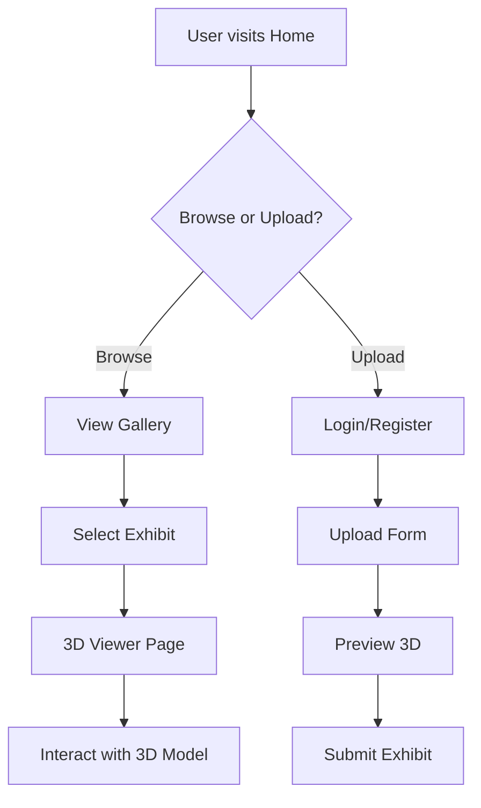

## 1. Product Overview
基于Web的3D展示系统，使用Three.js技术实现交互式3D模型展示，支持3D场景渲染、模型交互、视角控制等功能，为虚拟仿真作品提供在线展示平台。
- 主要目的：为参赛选手提供3D作品在线展示能力，无需安装专业软件即可浏览和交互
- 目标用户：虚拟仿真比赛参赛者、评委、观众

## 2. Core Features

### 2.1 User Roles
| Role | Registration Method | Core Permissions |
|------|---------------------|------------------|
| Guest | None | Browse 3D exhibits |
| Exhibitor | Email registration | Upload and manage 3D models |
| Admin | System assigned | Manage exhibits and users |

### 2.2 Feature Module
1. **Home page**: Hero section, featured exhibits, category navigation
2. **3D Viewer page**: 3D model rendering, camera controls, model info
3. **Exhibit Gallery**: List of all exhibits with thumbnails
4. **Upload page**: Model upload form, preview before submission

### 2.3 Page Details
| Page Name | Module Name | Feature description |
|-----------|-------------|---------------------|
| Home | Hero | Animated banner showcasing featured 3D works |
| Home | Featured | Curated selection of top exhibits |
| Home | Categories | Filter exhibits by category tags |
| 3D Viewer | Canvas | WebGL 3D rendering canvas |
| 3D Viewer | Controls | Rotate, zoom, pan camera controls |
| 3D Viewer | Info Panel | Display exhibit details and creator info |
| Gallery | Grid | Responsive grid layout of exhibit thumbnails |
| Upload | Form | File upload with drag-drop support |
| Upload | Preview | Real-time 3D preview before submission |

## 3. Core Process

## 4. User Interface Design
### 4.1 Design Style
- **Primary color**: Deep blue (#1a365d) - professional, tech-focused
- **Secondary color**: Cyan accent (#00d4ff) - highlights and interactions
- **Button style**: Rounded corners, gradient backgrounds, hover animations
- **Font**: Inter for body, Playfair Display for headings
- **Layout**: Modern card-based design with generous spacing
- **Icon style**: Minimal line icons from lucide-react

### 4.2 Page Design Overview
| Page Name | Module Name | UI Elements |
|-----------|-------------|-------------|
| Home | Hero | Full-width gradient background, floating 3D preview thumbnail, call-to-action buttons |
| Home | Featured | Card grid with 3D model thumbnails, title, creator name, category badge |
| 3D Viewer | Canvas | Full-screen WebGL canvas, semi-transparent control panel overlay |
| 3D Viewer | Controls | Orbit controls hint, zoom slider, reset button |
| Gallery | Filter | Category filter chips at top, search input |

### 4.3 Responsiveness
- Desktop-first approach
- Mobile adaptive with touch-optimized controls
- Tablet layout with collapsed sidebar

### 4.4 3D Scene Guidance
- **Environment**: Neutral gray background with subtle gradient
- **Lighting**: Three-point lighting setup (key, fill, rim)
- **Camera**: Orbit controls with automatic rotation option
- **Composition**: Model centered in viewport with proper framing
- **Interactions**: Mouse/touch drag to rotate, scroll to zoom, right-click to pan
- **Post-processing**: Antialiasing, subtle bloom effect
- **Performance**: Level of detail switching for complex models