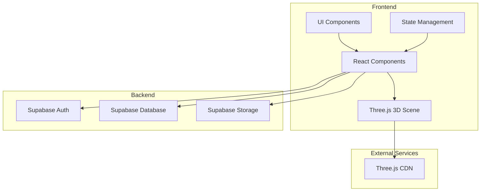
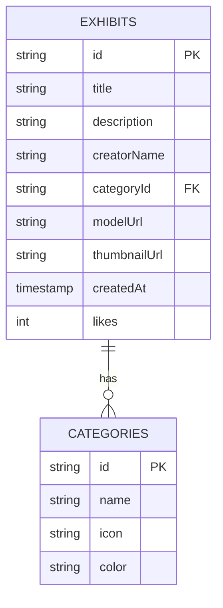

## 1. Architecture Design


## 2. Technology Description
- **Frontend**: React@18 + TypeScript + TailwindCSS@3 + Vite
- **3D Library**: Three.js + @react-three/fiber + @react-three/drei
- **State Management**: Zustand
- **Routing**: React Router DOM
- **Backend**: Supabase (Auth, Database, Storage)
- **Build Tool**: Vite@6

## 3. Route Definitions
| Route | Purpose | Component |
|-------|---------|-----------|
| `/` | Home page with featured exhibits | Home.tsx |
| `/gallery` | Browse all exhibits | Gallery.tsx |
| `/viewer/:id` | 3D model viewer page | Viewer.tsx |
| `/upload` | Upload new 3D model | Upload.tsx |
| `/login` | User login page | Login.tsx |

## 4. API Definitions
### 4.1 Exhibit Model
```typescript
interface Exhibit {
  id: string;
  title: string;
  description: string;
  creatorName: string;
  category: string;
  modelUrl: string;
  thumbnailUrl: string;
  createdAt: string;
  likes: number;
}
```

### 4.2 Category Model
```typescript
interface Category {
  id: string;
  name: string;
  icon: string;
  color: string;
}
```

## 5. Data Model
### 5.1 ER Diagram


### 5.2 DDL Statements
```sql
CREATE TABLE categories (
  id UUID PRIMARY KEY DEFAULT gen_random_uuid(),
  name VARCHAR(50) NOT NULL,
  icon VARCHAR(50),
  color VARCHAR(7)
);

CREATE TABLE exhibits (
  id UUID PRIMARY KEY DEFAULT gen_random_uuid(),
  title VARCHAR(100) NOT NULL,
  description TEXT,
  creatorName VARCHAR(50) NOT NULL,
  categoryId UUID REFERENCES categories(id),
  modelUrl VARCHAR(255) NOT NULL,
  thumbnailUrl VARCHAR(255),
  createdAt TIMESTAMP DEFAULT CURRENT_TIMESTAMP,
  likes INT DEFAULT 0
);

INSERT INTO categories (name, icon, color) VALUES 
('Architecture', 'Building2', '#3b82f6'),
('Product Design', 'Box', '#10b981'),
('Game Assets', 'Gamepad2', '#f59e0b'),
('Art', 'Palette', '#ec4899'),
('Education', 'GraduationCap', '#8b5cf6');
```

## 6. Component Structure
```
src/
├── components/
│   ├── 3D/
│   │   ├── Scene.tsx          # Three.js scene wrapper
│   │   ├── ModelViewer.tsx    # 3D model renderer
│   │   └── CameraControls.tsx # Orbit controls
│   ├── UI/
│   │   ├── Header.tsx         # Navigation header
│   │   ├── Card.tsx           # Exhibit card
│   │   └── Button.tsx         # Custom button
│   └── Layout/
│       └── PageLayout.tsx     # Page wrapper
├── pages/
│   ├── Home.tsx
│   ├── Gallery.tsx
│   ├── Viewer.tsx
│   ├── Upload.tsx
│   └── Login.tsx
├── hooks/
│   ├── useExhibits.ts         # Fetch exhibits data
│   └── use3DScene.ts          # Three.js scene management
├── store/
│   └── appStore.ts            # Zustand store
└── utils/
    └── supabaseClient.ts      # Supabase configuration
```

## 7. 3D Implementation Details
- **Scene Setup**: React Three Fiber canvas with shadows enabled
- **Lighting**: AmbientLight + DirectionalLight + PointLight
- **Camera**: PerspectiveCamera with orbit controls
- **Model Loading**: GLTFLoader for GLB/GLTF models
- **Post-processing**: EffectComposer with SMAA and bloom
- **Performance**: Instancing for multiple objects, LOD when needed